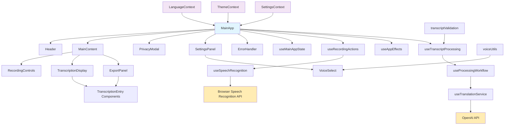

# Приложение для распознавания речи и перевода в реальном времени

## Описание проекта

Это веб-приложение для распознавания речи и перевода в реальном времени, построенное на React и TypeScript. Приложение использует браузерный API распознавания речи и OpenAI API для перевода текста между различными языками.

## Основные возможности

- 🎤 **Распознавание речи в реальном времени** - использует встроенный API браузера
- 🌍 **Перевод между языками** - поддержка множества языков через OpenAI API
- 🎨 **Современный интерфейс** - адаптивный дизайн с поддержкой темной темы
- 📝 **Экспорт результатов** - сохранение транскрипций и переводов
- ⚙️ **Гибкие настройки** - выбор языков, моделей ИИ и голосов
- 🔒 **Приватность** - обработка данных с согласия пользователя

## Архитектура приложения



### Описание компонентов:

#### Основные компоненты UI:
- **MainApp** - корневой компонент, управляющий глобальным состоянием
- **Header** - заголовок с настройками и переключением темы
- **MainContent** - основной контент с вкладками транскрипции и экспорта
- **RecordingControls** - элементы управления записью (старт/стоп)
- **TranscriptionDisplay** - отображение оригинального и переведенного текста

#### Хуки и логика:
- **useMainAppState** - управление состоянием приложения
- **useSpeechRecognition** - интеграция с API распознавания речи
- **useTranscriptProcessing** - обработка и валидация транскрипций
- **useTranslationService** - взаимодействие с OpenAI API
- **useProcessingWorkflow** - координация процесса обработки

#### Контексты:
- **LanguageContext** - управление языковыми настройками
- **ThemeContext** - управление темами оформления
- **SettingsContext** - глобальные настройки приложения

## Технологический стек

- **Frontend Framework**: React 18 с TypeScript
- **Сборщик**: Vite
- **Стилизация**: Tailwind CSS
- **UI Компоненты**: shadcn/ui
- **Управление состоянием**: React Context + Hooks
- **API для речи**: Web Speech API (браузерный)
- **API для перевода**: OpenAI GPT API
- **Иконки**: Lucide React

## Установка и запуск

### Предварительные требования
- Node.js (версия 18 или выше)
- npm или yarn

### Локальная разработка

```bash
# Клонирование репозитория
git clone <URL_РЕПОЗИТОРИЯ>

# Переход в директорию проекта
cd <ИМЯ_ПРОЕКТА>

# Установка зависимостей
npm install

# Запуск сервера разработки
npm run dev
```

### Настройка API ключей

1. Откройте настройки приложения (иконка шестеренки)
2. Введите ваш OpenAI API ключ в соответствующее поле
3. Выберите предпочитаемую модель ИИ (GPT-3.5-turbo, GPT-4 и т.д.)

## Использование

1. **Настройка языков**: Выберите исходный и целевой языки в настройках
2. **Начало записи**: Нажмите кнопку записи и разрешите доступ к микрофону
3. **Говорите**: Приложение будет распознавать вашу речь в реальном времени
4. **Просмотр перевода**: Переведенный текст появится в правой панели
5. **Экспорт**: Используйте вкладку "Экспорт" для сохранения результатов

## Особенности реализации

### Валидация транскрипций
Приложение использует умную систему валидации для предотвращения избыточной обработки:
- Минимальная длина текста для обработки
- Проверка количества нового контента
- Обнаружение сброса транскрипции

### Обработка ошибок
- Автоматическое восстановление соединения с API речи
- Уведомления пользователя об ошибках
- Возможность повторной попытки операций

### Оптимизация производительности
- Дебаунсинг запросов к API
- Кэширование результатов перевода
- Ленивая загрузка компонентов

## Развертывание

Приложение может быть развернуто на любом статичном хостинге:

1. **Через Lovable**: Нажмите "Share" → "Publish" в интерфейсе Lovable
2. **Вручную**: 
   ```bash
   npm run build
   # Загрузите содержимое папки dist на ваш хостинг
   ```

## Поддерживаемые браузеры

- Chrome 25+
- Firefox 44+
- Safari 14.1+
- Edge 79+

**Примечание**: Web Speech API имеет ограниченную поддержку в некоторых браузерах.

## Лицензия

Этот проект создан с помощью Lovable и доступен для изучения и модификации.

## Поддержка

Для получения помощи:
- Откройте issue в репозитории
- Обратитесь к [документации Lovable](https://docs.lovable.dev/)
- Присоединитесь к [Discord сообществу Lovable](https://discord.com/channels/1119885301872070706/1280461670979993613)
